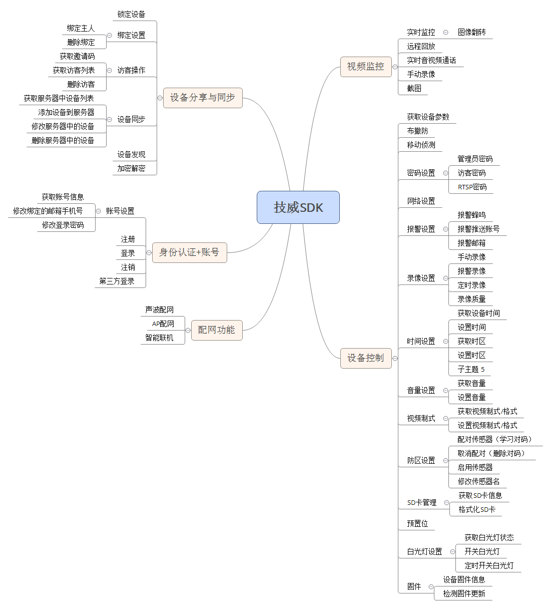
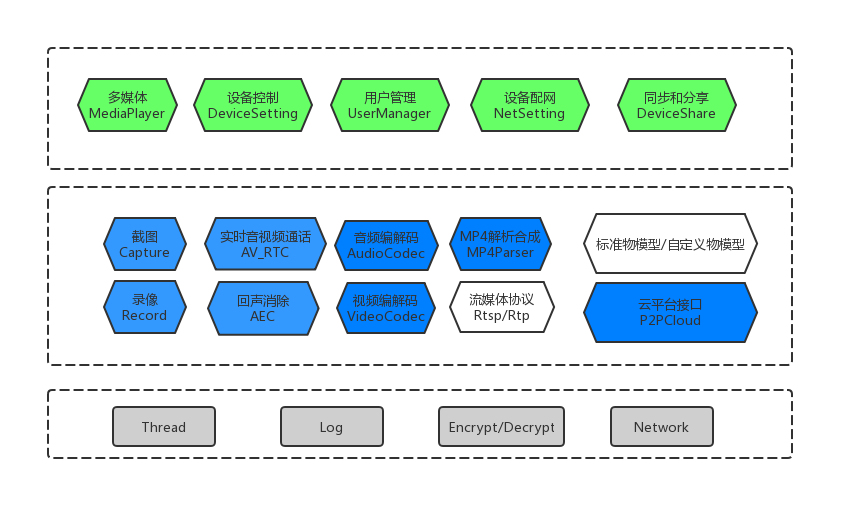

# 简介
SDK 是深圳市技威时代科技有限公司研发的基于Cloudlink™ P2P的智能家居平台工具集。SDK将监控、录像、回放、设备控制、设备通讯、设备报警等功能进行简单封装，方便合作伙伴集成。 

# 功能概述

## 【用户管理】
基于平台提供的账号体系，开发者可以实现自有APP开发中的注册、登录、忘记密码、登出、修改用户信息等功能。 
- [详见文档](用户管理开发指南.md)

## 【分享和同步】
提供了向好友分享控制设备的能力。支持分享者和被分享者对分享的设备进行增加、删除、查询、修改。
- [详见文档](分享与同步开发指南.md)

## 【设备配网】
提供设备配网能力，支持多种配网方式，包含WiFi设备配网、声波配网、AP配网、蓝牙连接配网。
- [详见文档](设备配网开发指南.md)

## 【设备控制】
 提供了丰富的接口供开发者实现设备信息的获取和管理能力。设备相关的返回数据都采用异步消息的方式通知接受者。  
- [详见文档](设备控制开发指南.md)

## 【多媒体】
提供音视频能力，包含实时监控、实时音视频通话、远程回放、录像、截图等功能
- [详见文档](多媒体指南.md)

# 架构
架构图如下：

# 平台支持
具体平台支持情况如下表所示：

| 平台       | SDK 及兼容性                                                 | Demo 体验 | Demo 源码下载 |
| :--------- | :----------------------------------------------------------- | :-------- | :------------ |
| iOS        | 支持；兼容 iOS 9.0 及以上版本的 iPhone 或者 iPad 真机。      | 支持      | 支持          |
| Android    | 支持；最低兼容 Android 4.1（SDK API Level 16），建议使用 Android 5.0 （SDK API Level 21）及以上版本。 | 支持      | 支持          |
| Windows    | 支持；兼容 Windows 7 及以上版本。                            | 支持      | 支持          |
