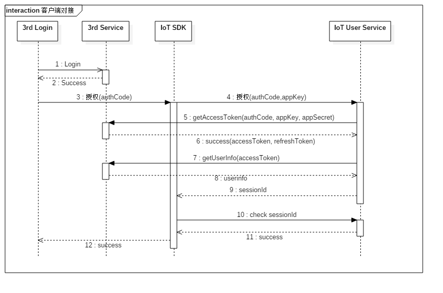

# 账户体系

## 1. 注册
支持邮箱和手机号注册，其中大陆（+86）手机号注册需要验证码，暂未开放非大陆手机号注册功能。

#### 流程图 :


#### 接口描述 :


```swift
struct AccountManager {
    
    // MARK: - 注册
    func register(withEmail email: String, password: String, verificationCode: String, responseHandler:(([AnyHashable : Any]) -> Void)?) {}
    func register(withPhoneNumber phoneNumber: String, password: String, verificationCode: String, responseHandler:(([AnyHashable : Any]) -> Void)?) {}

    
    // MARK: - 登录
    func login(withEmail email: String, password: String, responseHandler:(([AnyHashable : Any]) -> Void)?) {}
    func login(withPhoneNumber phoneNumber: String, password: String, responseHandler:(([AnyHashable : Any]) -> Void)?) {}
    func login(withThirdParty openId: String, password: String, extraInfo:[AnyHashable : Any],  responseHandler:(([AnyHashable : Any]) -> Void)?) {}
    func login(withAccountId accountId: String, password: String, responseHandler:(([AnyHashable : Any]) -> Void)?) {}

    
    // MARK: - 登出
    func logout(withAccountId accountId: String, sessionId: String, responseHandler:(([AnyHashable : Any]) -> Void)?) {}

    
    // MARK: - 注销账户
    func deregister(withAccountId accountId: String, sessionId: String, responseHandler:(([AnyHashable : Any]) -> Void)?) {}
    
    
    // MARK: - 账户信息管理
    func getUserInfo(withAccountId accountId: String, sessionId: String, responseHandler:(([AnyHashable : Any]) -> Void)?) {}
    func modifyUserInfo(withAccountId accountId: String, sessionId: String, modifiedInfo: [AnyHashable : Any], responseHandler:(([AnyHashable : Any]) -> Void)?) {}
    func resetPassword(withAccountId accountId: String, oldPassword: String, newPassword: String, verificationCode: String, responseHandler:(([AnyHashable : Any]) -> Void)?) {}
    
    
    // MARK: - 分享体系
    //#### 5.1 设备分享
    func shareDevice(_ deviceId: String, to accountId: String, responseHandler:(([AnyHashable : Any]) -> Void)?) {}
    //#### 5.2 访客管理（增/删/改/查）
    func getDeviceVisitors(_ deviceId: String, accountId: String, responseHandler:(([AnyHashable : Any]) -> Void)?) {}
    //#### 5.3 权限管理
    func setVisitorPermission(_ deviceId: String, accountId: String, responseHandler:(([AnyHashable : Any]) -> Void)?) {}

    
    // MARK: - 设备关联
    func addDevice(_ deviceId: String, accountId: String, responseHandler:(([AnyHashable : Any]) -> Void)?) {}
    func delDevice(_ deviceId: String, accountId: String, responseHandler:(([AnyHashable : Any]) -> Void)?) {}

    // MARK: - 消息推送
    //#### 7.1 上传离线推送token
    func registerForRemoteNotifications(_ deviceToken: String, responseHandler:(([AnyHashable : Any]) -> Void)?) {}

    // MARK: - 验证码
    func getVerificationCode(forEmail email: String, responseHandler:(([AnyHashable : Any]) -> Void)?) {}
    func getVerificationCode(forPhoneNumber phoneNumber: String, responseHandler:(([AnyHashable : Any]) -> Void)?) {}

}
```

#### 说明：

1、注册接口不可频繁调用，有封IP限制； 

2、手机号及邮箱的有效性需要你方自行验证； 

3、手机号注册时建议通过短信验证码；

如您不希望用户以账号+密码的方式登录，SDK提供第三方平台登录（如微信登录），见[第三方登录目录](https://www.showdoc.cc/web/#/page/195506522292468)


#### 请求示例 :
```java
//this is sample
```

## 2. 登录

### 2.1  账号登录

### 2.2  三方登录

## 3.  注销

## 4.  账号设置

### 4.1 获取账号信息

### 4.2 修改账号信息

### 4.3 修改绑定的邮箱和手机号

### 4.4 修改登录密码
