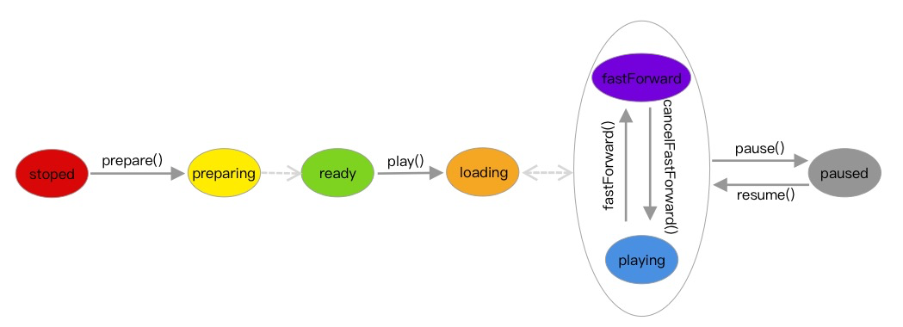

# 多媒体指南

## 概览

播放器负责提供编解码及渲染的功能，底层依赖于p2p库的推拉流及音视频同步功能

### 1. 播放器状态流程图

### 2. 功能列表

|      **功能**      | 监控播放器 | **回放播放器** | 音视频通话 |
| :----------------: | :--------: | :------------: | :--------: |
|      视频播放      |     ✓      |       ✓        |     ✓      |
|      音频播放      |     ✓      |       ✓        |     ✓      |
|     暂停/恢复      |     x      |       ✓        |     x      |
|  跳至指定位置播放  |     x      |       ✓        |     x      |
|       总时长       |     x      |       ✓        |     x      |
|    当前播放进度    |     x      |       ✓        |     x      |
| 播放器状态变更通知 |     ✓      |       ✓        |     ✓      |
|       静音        |     ✓      |       ✓        |     ✓      |
|      变速播放      |     x      |       ✓        |     x      |
|  画面缩放模式设置  |     ✓      |       ✓        |     ✓      |
|     播放器截图     |     ✓      |       ✓        |     ✓      |
|      边播边录      |     ✓      |       ✓        |     ✓      |
|        对讲        |     ✓      |       ✓        |     ✓      |
|   分辨率切换        |     ✓      |       x        |     x      |
| 双向视频 | x | x | ✓ |

## SDK接口（IotVideoPlayer）

### 播放器核心层

####  1. 基础播放器（IotVideoPlayer）

##### 1.1 视频编码

###### 定义描述
| 名称 | 版本 | 描述 |
| --- | --- | --- |
| videoEncode | 1.0.0 | 视频编码  |

###### 请求参数
| 参数 | 类型 | 非空 | 描述 |
| --- | --- | --- | --- |
| vRawFrame | VRawFrame | 是 | 原始视频帧 |

###### 返回参数
| 类型 | 非空 | 描述 |
| --- | --- | --- |
| VPacket | 否 | 已编码视频帧 |

##### 1.2 视频解码

###### 定义描述
| 名称 | 版本 | 描述 |
| --- | --- | --- |
| videoDecode | 1.0.0 | 视频解码  |

###### 请求参数
| 参数 | 类型 | 非空 | 描述 |
| --- | --- | --- | --- |
| vPacket | VPacket | 是 | 已编码视频帧 |

###### 返回参数
| 类型 | 非空 | 描述 |
| --- | --- | --- |
| VRawFrame | 否 | 原始视频帧 |

##### 1.3 音频编码

###### 定义描述
| 名称        | 版本  | 描述     |
| ----------- | ----- | -------- |
| audioEncode | 1.0.0 | 音频编码 |

###### 请求参数
| 参数      | 类型      | 非空 | 描述       |
| --------- | --------- | ---- | ---------- |
| aRawFrame | ARawFrame | 是   | 原始音频帧 |

###### 返回参数
| 类型    | 非空 | 描述         |
| ------- | ---- | ------------ |
| APacket | 否   | 已编码音频帧 |

##### 1.4 音频解码

###### 定义描述
| 名称        | 版本  | 描述     |
| ----------- | ----- | -------- |
| audioDecode | 1.0.0 | 音频解码 |

###### 请求参数
| 参数    | 类型    | 非空 | 描述         |
| ------- | ------- | ---- | ------------ |
| aPacket | APacket | 是   | 已编码音频帧 |

###### 返回参数
| 类型      | 非空 | 描述       |
| --------- | ---- | ---------- |
| ARawFrame | 否   | 原始音频帧 |

##### 1.5 录像

###### 定义描述
| 名称        | 版本  | 描述     |
| ----------- | ----- | -------- |
| startRecord | 1.0.0 | 开始录像 |

###### 请求参数
| 参数              | 类型   | 非空 | 描述             |
| ----------------- | ------ | ---- | ---------------- |
| path              | String | 否   | 指定录像保存路径 |
| completionHandler | Object | 否   | 录像结束回调     |

###### 返回参数
| 类型 | 非空 | 描述     |
| ---- | ---- | -------- |
| Void | 否   | 无返回值 |

##### 1.6 停止录像

###### 定义描述
| 名称       | 版本  | 描述     |
| ---------- | ----- | -------- |
| stopRecord | 1.0.0 | 停止录像 |

###### 请求参数
| 参数 | 类型 | 非空 | 描述   |
| ---- | ---- | ---- | ------ |
|      |      |      | 无参数 |

###### 返回参数
| 类型 | 非空 | 描述     |
| ---- | ---- | -------- |
|      |      | 无返回值 |

##### 1.7 截图

###### 定义描述
| 名称           | 版本  | 描述         |
| -------------- | ----- | ------------ |
| takeScreenshot | 1.0.0 | 视频画面截图 |

###### 请求参数
| 参数              | 类型   | 非空 | 描述             |
| ----------------- | ------ | ---- | ---------------- |
| path              | String | 否   | 指定录像保存路径 |
| completionHandler | Object | 否   | 录像结束回调     |

###### 返回参数
| 类型 | 非空 | 描述     |
| ---- | ---- | -------- |
|      |      | 无返回值 |

##### 1.8 回音消除

###### 定义描述

| 名称             | 版本  | 描述     |
| ---------------- | ----- | -------- |
| noiseSuppression | 1.0.0 | 回音消除 |

###### 请求参数
| 参数              | 类型   | 非空 | 描述             |
| ----------------- | ------ | ---- | ---------------- |
| inData            | Data   | 是   | 输入音频 |

###### 返回参数
| 类型 | 非空 | 描述     |
| ---- | ---- | -------- |
| Data     |  是    | 回音消除后的音频 |

##### 1.9 准备播放

###### 定义描述

| 名称    | 版本  | 描述     |
| ------- | ----- | -------- |
| prepare | 1.0.0 | 准备播放 |

###### 请求参数

| 参数 | 类型 | 非空 | 描述   |
| ---- | ---- | ---- | ------ |
|      |      |      | 无参数 |

###### 返回参数

| 类型 | 非空 | 描述     |
| ---- | ---- | -------- |
|      |      | 无返回值 |

##### 1.10 开始播放

###### 定义描述
| 名称 | 版本  | 描述     |
| ---- | ----- | -------- |
| play | 1.0.0 | 开始播放 |

###### 请求参数
| 参数 | 类型 | 非空 | 描述     |
| ---- | ---- | ---- | -------- |
|      |      |      | 无参数 |

###### 返回参数
| 类型 | 非空 | 描述     |
| ---- | ---- | -------- |
|      |      | 无返回值 |

##### 1.11 暂停播放

###### 定义描述
| 名称  | 版本  | 描述     |
| ----- | ----- | -------- |
| pause | 1.0.0 | 暂停播放 |

###### 请求参数
| 参数 | 类型 | 非空 | 描述 |
| ---- | ---- | ---- | ---- |
|      |      |      | 无参数 |

###### 返回参数
| 类型 | 非空 | 描述     |
| ---- | ---- | -------- |
|      |      | 无返回值 |

##### 1.12 恢复播放

###### 定义描述
| 名称  | 版本  | 描述     |
| ----- | ----- | -------- |
| resume | 1.0.0 | 恢复播放 |

###### 请求参数
| 参数 | 类型 | 非空 | 描述 |
| ---- | ---- | ---- | ---- |
|      |      |      | 无参数 |

###### 返回参数
| 类型 | 非空 | 描述     |
| ---- | ---- | -------- |
|      |      | 无返回值 |

##### 1.13 停止播放

###### 定义描述
| 名称  | 版本  | 描述     |
| ----- | ----- | -------- |
| stop | 1.0.0 | 停止播放 |

###### 请求参数
| 参数 | 类型 | 非空 | 描述 |
| ---- | ---- | ---- | ---- |
|      |      |      | 无参数 |

###### 返回参数
| 类型 | 非空 | 描述     |
| ---- | ---- | -------- |
|      |      | 无返回值 |

##### 1.14 静音

###### 定义描述
| 名称  | 版本  | 描述     |
| ----- | ----- | -------- |
| mute | 1.0.0 | 静音 |

###### 请求参数
| 参数 | 类型 | 非空 | 描述 |
| ---- | ---- | ---- | ---- |
|      |      |      | 无参数 |

###### 返回参数
| 类型 | 非空 | 描述     |
| ---- | ---- | -------- |
|      |      | 无返回值 |

##### 1.15 开始对讲

###### 定义描述
| 名称  | 版本  | 描述     |
| ----- | ----- | -------- |
| startTalk | 1.0.0 | 开始对讲 |

###### 请求参数
| 参数 | 类型 | 非空 | 描述 |
| ---- | ---- | ---- | ---- |
|      |      |      | 无参数 |

###### 返回参数
| 类型 | 非空 | 描述     |
| ---- | ---- | -------- |
|      |      | 无返回值 |

##### 1.16 结束对讲

###### 定义描述
| 名称  | 版本  | 描述     |
| ----- | ----- | -------- |
| stopTalk | 1.0.0 | 结束对讲 |

###### 请求参数
| 参数 | 类型 | 非空 | 描述 |
| ---- | ---- | ---- | ---- |
|      |      |      | 无参数 |

###### 返回参数
| 类型 | 非空 | 描述     |
| ---- | ---- | -------- |
|      |      | 无返回值 |

##### 1.17 状态回调

###### 定义描述
| 名称  | 版本  | 描述     |
| ----- | ----- | -------- |
| didUpdateStatus | 1.0.0 | 状态变更回调 |

###### 请求参数
| 参数 | 类型 | 非空 | 描述 |
| ---- | ---- | ---- | ---- |
| status | AVStatus | 是 | 播放器状态 |

###### 返回参数
| 类型 | 非空 | 描述     |
| ---- | ---- | -------- |
|      |      | 无返回值 |

##### 1.18 时间回调

###### 定义描述

| 名称                 | 版本  | 描述                 |
| -------------------- | ----- | -------------------- |
| didUpdateCurrentTime | 1.0.0 | 当前播放时间变更回调 |

###### 请求参数

| 参数        | 类型   | 非空 | 描述       |
| ----------- | ------ | ---- | ---------- |
| currentTime | CMTime | 是   | 播放器时间 |

###### 返回参数

| 类型 | 非空 | 描述     |
| ---- | ---- | -------- |
|      |      | 无返回值 |

##### 1.19 错误回调

###### 定义描述

| 名称            | 版本  | 描述         |
| --------------- | ----- | ------------ |
| didReceiveError | 1.0.0 | 播放出错回调 |

###### 请求参数

| 参数  | 类型  | 非空 | 描述     |
| ----- | ----- | ---- | -------- |
| error | Error | 是   | 错误详情 |

###### 返回参数

| 类型 | 非空 | 描述     |
| ---- | ---- | -------- |
|      |      | 无返回值 |

#### 2. 监控播放器（MonitorPlayer）

继承自 [基础播放器（IotVideoPlayer）](#1. 基础播放器（IotVideoPlayer）) 

#### 3. 回放播放器（PlaybackPlayer）
继承自 [基础播放器（IotVideoPlayer）](#1. 基础播放器（IotVideoPlayer）) 

##### 3.1 拖动

###### 定义描述
| 名称  | 版本  | 描述     |
| ----- | ----- | -------- |
| seek | 1.0.0 | 指定时间播放 |

###### 请求参数
| 参数 | 类型 | 非空 | 描述 |
| ---- | ---- | ---- | ---- |
| time | CMTime | 是 | 指定时间 |

###### 返回参数
| 类型 | 非空 | 描述     |
| ---- | ---- | -------- |
|      |      | 无返回值 |

##### 3.2 快进

###### 定义描述
| 名称  | 版本  | 描述     |
| ----- | ----- | -------- |
| fastForward | 1.0.0 | 快进播放 |

###### 请求参数
| 参数 | 类型 | 非空 | 描述 |
| ---- | ---- | ---- | ---- |
|      |      |       | 无参数 |

###### 返回参数
| 类型 | 非空 | 描述     |
| ---- | ---- | -------- |
|      |      | 无返回值 |

##### 3.3 取消快进

###### 定义描述
| 名称  | 版本  | 描述     |
| ----- | ----- | -------- |
| cancelFastForward | 1.0.0 | 取消快进播放 |

###### 请求参数
| 参数 | 类型 | 非空 | 描述 |
| ---- | ---- | ---- | ---- |
|      |      |       | 无参数 |

###### 返回参数
| 类型 | 非空 | 描述     |
| ---- | ---- | -------- |
|      |      | 无返回值 |

#### 4. 音视频通话（LivePlayer）
继承自 [基础播放器（IotVideoPlayer）](#1. 基础播放器（IotVideoPlayer）) 

##### 4.1 打开摄像头

###### 定义描述
| 名称  | 版本  | 描述     |
| ----- | ----- | -------- |
| openCamera | 1.0.0 | 打开摄像头 |

###### 请求参数
| 参数 | 类型 | 非空 | 描述 |
| ---- | ---- | ---- | ---- |
|  cam    |  enum Camera | 是 | front: 前置, rear: 后置 |

###### 返回参数
| 类型 | 非空 | 描述     |
| ---- | ---- | -------- |
| Int |  是    | 参考错误码 |

##### 4.2 切换摄像头

###### 定义描述
| 名称  | 版本  | 描述     |
| ----- | ----- | -------- |
| switchToCamera | 1.0.0 | 切换摄像头 |

###### 请求参数
| 参数 | 类型 | 非空 | 描述 |
| ---- | ---- | ---- | ---- |
|  cam    |  enum Camera | 是 | front: 前置, rear: 后置 |

###### 返回参数
| 类型 | 非空 | 描述     |
| ---- | ---- | -------- |
| Int |  是    | 参考错误码 |

##### 4.3 关闭摄像头

###### 定义描述
| 名称  | 版本  | 描述     |
| ----- | ----- | -------- |
| closeCamera | 1.0.0 | 关闭摄像头 |

###### 请求参数
| 参数 | 类型 | 非空 | 描述 |
| ---- | ---- | ---- | ---- |
|     |   |   |  无参数 |

###### 返回参数
| 类型 | 非空 | 描述     |
| ---- | ---- | -------- |
| Int |  是    | 参考错误码 |

### 播放器组件层

#### 1. 基础播放器组件(VideoView)

##### 1.1 视频渲染

###### 定义描述
| 名称  | 版本  | 描述     |
| ----- | ----- | -------- |
| draw | 1.0.0 | 视频渲染 |

###### 请求参数
| 参数 | 类型 | 非空 | 描述 |
| ---- | ---- | ---- | ---- |
| frame | VRawFrame | 是 | 原始视频帧 |
| rect | CGRect | 是 | 渲染区域 |

###### 返回参数
| 类型 | 非空 | 描述     |
| ---- | ---- | -------- |
|      |      | 无返回值 |

##### 1.2 音频播放

###### 定义描述
| 名称  | 版本  | 描述     |
| ----- | ----- | -------- |
| play | 1.0.0 | 音频播放 |

###### 请求参数
| 参数 | 类型 | 非空 | 描述 |
| ---- | ---- | ---- | ---- |
| audio | ARawFrame | 是 | 原始音频帧 |

###### 返回参数
| 类型 | 非空 | 描述     |
| ---- | ---- | -------- |
|      |      | 无返回值 |

## 开发指南
* [iOS 多媒体SDK](ios/多媒体.md)
* [Android 多媒体SDK](Android/多媒体.md)

## 参考
//流程

## 常见问题

